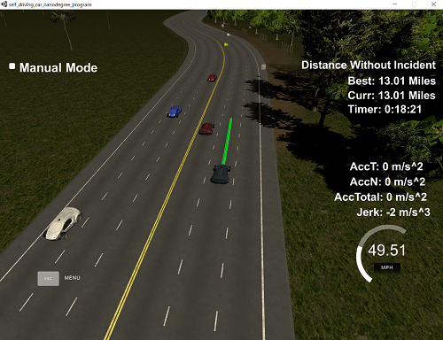
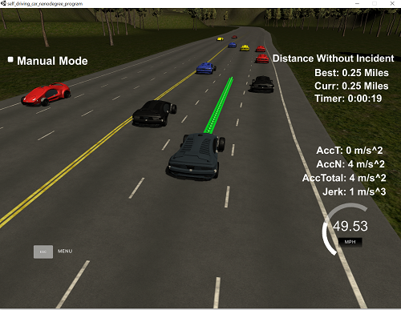
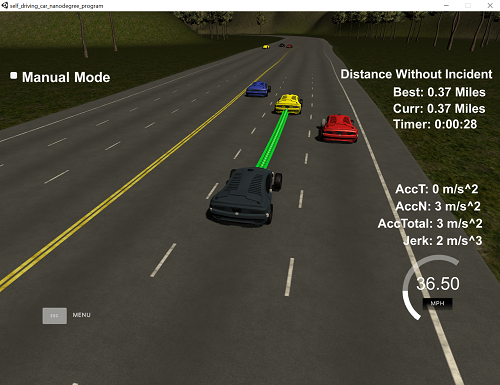

# Path Planning Project Report

## Goal of the project

In this project, the goal was to drive around the highway provided in the Udacity simulation environment. A map of the highway was given, and the simulator provided the ego vehicle position and also sensor fusion data, which contained the estimated states of other traffic participants in the environment. The project specifically asked for completing 1 loop around the highway without any "incidents", such as collisions or high jerk movements. 

---

## Project Details

In this section, I'll provide details about how the goal was met. All of the functional code can be found in `main.cpp` in `src` folder. 

### Summary

Overall, the project was challenging; however, it was exciting to be see the drive complete a lap around the test track. I followed a very incremental step; where couple of my steps were:
- Drive around the test track in single lane
- Avoid collision with objects in front
- Force change lanes
- Use splines for smooth trajectories
- Add acceleration, jerk components in trajectory calculation
- Implement vehicle states
- Implement cost functions to choose the minimum cost state
- Optimmization

I started with 5 states as recommended in the classroom (Keep Lane, Prepare Lane Change Left/Right, Lane Change Left/Right), however, during implementation, I didn't find a immediate need for adjusting speed. I believe this is because the cost functions I implemented are fairly *conservative* and the I tolerated keeping in lane more rather than speeding up to have earlier lane changes. 

I must state that although there are so many rooms for improvement and modifications can be made, I believe what I have right now is sufficient for the project. That's why I stopped here for development. That being said, the drive is not **incident-free* and the incidents that I have observed are explained in detail below with potential root causes. 

---

### Observed Incidents

*The vehicle can drive more than 4.32 without incidents on the given highway*, as seen on the image below. Please note that in certain traffic conditions I have observed that the vehicle may face an incident before reaching 4.32 miles; however, these were rare occasions in my try. 
 

#### List of Incidents:
**1. Exceeding Jerk Limit:**
I have seen this happen only in very specific regions of the map. The main reason for this is I am using the previous path very indirectly in trajectory calculations.

**2. State fluctuations:**
Sometimes, especially when changing lanes, the target state and therefore the target trajectory can oscillate for 2 cycles. My hypothesis for this is because I calculate vehicle lane with each time step based on where the `ego.d` value is. If `ego.d` value is very close to lane border, I believe the calculation causes a wrong lane selection and causes ego to switch states. 

**3. Getting stuck behind vehicles:**
In rare cases where the ego vehicle is on an outer lane (left-most or right-most), and the ego lane and the next lane is occupied with another vehicle going at same speed, it might take a long time for ego to change lane. In these cases, even though one of the lanes is completely empty, ego will stay in its lane until it makes sense to change to **next** lane. 

The cause of this is two folds. Firstly, I don't have a behavior for double lane change. Secondly, the cost calculation does not take the outer-most lane into account. 

---

### Target Speed

*The car doesn't drive than speed limit, and also doesn't driving slow to obstruct traffic.* This is done by adding an acceleration logic in the code which checks the car's speed with respect to the speed limit. If the vehicle is below the speed limit, it will increase the speed of the ego vehicle. 

This is achieved in `src/main.cpp`, L531-552. 

---

### Limiting Acceleration and Jerk

I achieved acceleration and jerk limits by setting a jerk limit variable, `max_jerk`, and calculating next acceleration value by adding the multiplication of `max_jerk` and `t`, which is assumed to be constant at `0.02 s`. For smoother deceleration, I set the deceleration jerk a bit lower by multiplying with a constant `0.2`. 

This can be seen in `main.cpp`, L531-552.

---

### Collision Avoidance

**The car does not collide with any vehicles in lane changes, or while keeping lane.** For avoiding collision with the vehicle in front, I achieved this by decreasing the vehicle speed if a vehicle is detected in front for the target state. First, based on what the target state is, a target lane is selected (`main.cpp`, L516-529). Once target lane is selected, then the next vehicle in front of ego on that lane is scanned for its speed. If ego speed is greater than the object speed, then ego target acceleration is decreased. 

 

Scanning of objects ahead of vehicle is achieved through `get_vehicles_in_lane()` function (`main.cpp`, L390-422). Object speed calculation and setting ego target acceleration is done in `main()`, L541-544. 

Collision avoidance on lane changes were achieved via cost function. Essentially, any lane change move is considered as a very high cost state if there's an object in close proximity of the ego vehicle in target lane. This cost is calculated in `calc_cost_collision()` function (L246-267).

---

### In-Lane Driving

**The car doesn't spend more than a 3 second length out side the lane lanes during changing lanes, and every other time the car stays inside one of the 3 lanes on the right hand side of the road.** For more details on how this is achieved, please see **Reflection - How To Generate Paths** section of this document. 

---

### Lane Changing

**The car is able to smoothly change lanes when it makes sense to do so, such as when behind a slower moving car and an adjacent lane is clear of other traffic.** I'm going to address this in two sections: when does the vehicle decide to change lanes, and how is trajectory for lane change calculated.

Firstly, the vehicle lane change decisions are done by finding the minimum cost state. If changing the lane is the minimum cost, then the vehicle will try to initiate a lane change. The cost calculation factors:
**1. Cost due to speed of lane:** This is calculated in `calc_cost_speed()` function (L269-325). If the speed of the lane is slow, then this is penalized by increasing the cost. 
**2. Cost due to lane emptiness:** This is calculated in `calc_cost_lane_emptiness()` function (L206-244). This simple cost function is intended to avoid us from changing lanes by being short sighted. If the lane is faster; however, there are multiple cars on the lane, I have observed the car to be eventually slowed down by traffic (lane following of other participants in the simulator is pretty bad). Therefore, a cost is assigned `0` if there are no vehicles in lane, `0.5` if there is one vehicle, and `1.0`, if there are more than 1 vehicles. 
**3. Cost due to collision:** This is calculated in `calc_cost_collision()` function (L246-267). Even if lane change makes sense, we have to avoid it if vehicle will collide with another vehicle. Therefore, cost is set to `1.0` if a collision is imminent, `0.0` otherwise. 
**4. Cost due to not being on right lane:** I've penalized being on left lane and staying there by adding a `0.1` cost to that as a constant, in `evaluate_successor_states()` L346-349 and L361-364. 
**5. Cost due to lane change:** I prefer vehicles to not change lanes too often. Therefore, I added a constant cost of `0.1` for any lane change state. Therefore, even if lane change is slightly better than keeping lane, the vehicle will keep lane. 

By calculating minimum cost out of these, the vehicle decides which state to be in, and thus initiates a lane change. 

Secondly, for trajectory calculation, I made target lane an input parameter for function `generate_state_spline()` (L101-165). This function returns a spline for target trajectory to be generated from. By setting the target lane in this function, the used spline will direct the vehicle towards the target lane, thus allowing vehicle to follow the trajectory for a lane change. For more details on trajectory generation, please see **Reflection - How to Generate Paths**

---

## Reflection - How to Generate Paths

I decided to write reflection and model documentation here. Firstly, path generation run at each time cycle, therefore all steps below are executed for every time the function runs. The description below describes code between L424-635

Paths are generated by first finding which states among the 3 possible states are available for the time cycle. These states are defined in `VehicleStates` enum class as `KeepLane`, `LaneChangeLeft`, and `LaneChangeRight`. For example, `LaneChangeRight` will never be a possible state when vehicle is on the right most lane. 

Then, each state is evaluated based on their cost. This is explained in more detail in **Lane Changing** section of this document. 

After determining which state is the minimum cost, `min_cost_state`, the state of the vehicle is changed to minimum cost state, and target lane is set according to the state. Based on the vehicle in front of ego on the target lane, a target acceleration value is calculated. 

In the next part, a spline is generated based on the ego's previous path, ego's current position, target lane, and map waypoints. This is done in `generate_state_spline()` function which returns a spline of `tk::spline` class. In order to generate the spline, I had to create a list of x and y points that the spline will be based off. X and Y points where based on 5 points from previous path, and 3 points obtained from the map based on ego vehicle position and target lane. Using the 5 points from previous paths were crucial to have a smooth changes in trajectory, this ensured that the next trajectory is not *too different* for path points close to the ego vehicle. 

After setting the X and Y points, next step was to transform all points to ego coordinate system. This made it a lot easier to work with spline, as spline expects increasing x values. Using map coordinates wouldn't have guaranteed this as the ego vehicle operates on a circular track. With the X and Y points being in ego coordinates, I used `set_points()` function to set the spline and returned it. 

Then, I decided to use 50 steps for trajectory calculation. For each step, an incremental distance was calculated based on the target speed, which was calculated based on the target acceleration. Then, this distance was added to the ego original x value (which is assumed to be 0) to get the `next_x` value. Then, `next_y` is simply calculated by plugging in `next_y` in the spline `s`. Then, these are transformed back to map coordinate system, and pushed back to the trajectory vectors, `next_x_vals` and `next_y_vals`.

**Note:** I have decided to not use previous path points in the trajectory calculation. Using previous path points in spline generation works well enough to smoothen out the vehicle behavior, and recalculation of path allows vehicle to react quicker and ability to achieve actions earlier. 